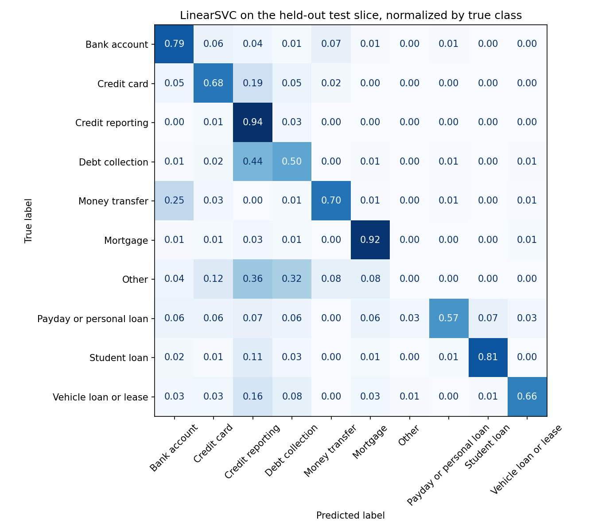
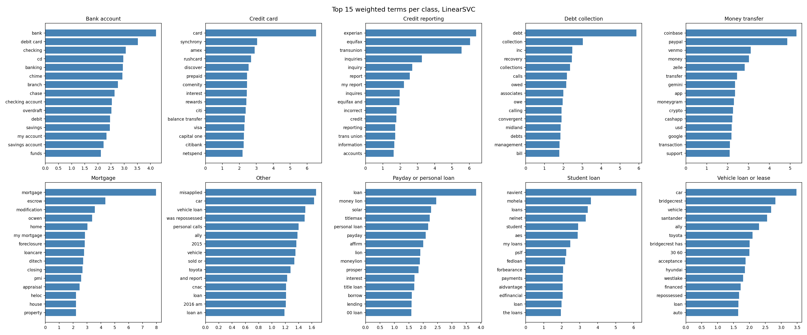

# CFPB Complaint Narrative Classifier

[](https://github.com/austi20/cfpb-complaint-nlp/actions/workflows/tests.yml)

Classifying free-text consumer-finance complaint narratives from the CFPB Consumer
Complaint Database into product categories, and surfacing the dominant complaint
themes inside each product with topic modeling.

Every complaint in this dataset is a real person describing, in their own words, a
problem with a bank, credit card, mortgage servicer, debt collector or credit bureau.
The text is messy: inconsistent length, redacted `XXXX` spans, typos, and heavy class
imbalance across products. That is the point. It is the kind of text an analytics team
at a bank or a regulator actually has to route and summarize.

**What I found:** a TF-IDF and LinearSVC classifier reaches **0.656 macro F1** on a
chronologically held out test slice, against **0.085** for a majority class baseline and
**0.643** for logistic regression on the same features. With a confidence cutoff set on
validation, it routes **70% of new complaints** on its own at **93.8% precision** and leaves 30%
for a person. The errors it makes are mostly real overlap in the CFPB taxonomy rather than
noise, and the topic models turned up a theme the taxonomy has no label for: credit repair
template letters, which are a document format rather than a complaint. **43% of the debt
collection complaints it files under credit reporting cite the Fair Credit Reporting Act**,
against 12% of the ones it gets right.

## Questions

1. Can a complaint's product category be predicted from its narrative alone, and by how
   much does that beat guessing the majority class?
2. Which issues does the model systematically confuse, and does that reveal genuine
   overlap in the CFPB taxonomy (for example credit reporting vs. debt collection)?
3. Within each product, what are the recurring complaint themes, and how do they differ
   from the CFPB's own `issue` labels?

## Data

Consumer Financial Protection Bureau, Consumer Complaint Database, originally sourced by CFPB,
pulled here through a historical mirror (see below).

As of 2026-09-16, the live CFPB channels no longer expose narrative text at all: the search
API's `_source` has no narrative field, `&format=csv` on the API has no narrative column, the
bulk `complaints.csv.zip` has no narrative column, and CFPB's own field reference
(`https://cfpb.github.io/api/ccdb/fields.html`) no longer lists one. All three checked and
confirmed narrative-free before falling back to a mirror.

- Data used: [Consumer Complaint Dataset](https://www.kaggle.com/datasets/namigabbasov/consumer-complaint-dataset)
  on Kaggle, a snapshot of the same CFPB database taken while narratives were still public.
  Covers complaints received 2015-03-19 through 2024-07-30. Downloaded via the Kaggle API.
- Field reference (for context on the original source): `https://cfpb.github.io/api/ccdb/fields.html`

Structured fields used: `product`, `sub_product`, `issue`, `company`, `timely`, `state`,
`date_received`. (`company_response` and `sub_issue` aren't in this mirror, so they're
dropped from the original plan's field list.) Text field: `narrative`. The mirror is
pre-filtered to narrative-bearing complaints only, so no separate has-narrative filter is
needed; a working set of 75,000 rows is sampled from the ~2M available for a size that's
fast to iterate on.

## Method

- The split is **chronological**, not random. The 75,000 complaints are sorted by
  `date_received`, the oldest 70% train, the next 15% validate and the newest 15% are held
  out as test. A random split leaks vocabulary that only exists late in the date range and
  inflates the score.
- CFPB renamed its product labels several times, so three spellings of credit reporting and
  three of payday lending are the same product with different strings. Aliases are merged
  first, then any product left with fewer than 500 complaints is collapsed into `Other`
  rather than pretended to be predictable. That leaves 10 classes.
- `XXXX` redaction spans are replaced with a space before vectorizing. They are not signal.
- Baselines: always predict the majority class, which shows why accuracy is the wrong
  metric, and logistic regression on the same features, which is the baseline a real
  model has to beat.
- Model: TF-IDF word 1 to 2 grams into a linear classifier, with class weights balanced
  because credit reporting is 60% of the training rows. Macro F1 is the headline metric
  because the classes are badly imbalanced.
- The model is picked on validation, then refit on train plus validation and scored on the
  test slice once. Validation is spent by then, and folding it back in lets the model see
  vocabulary right up to the test cutoff.
- The gap between the two linear models gets a 95% interval from a paired bootstrap: resample
  the scored rows 1,000 times with replacement, score both models on each resample, keep the
  difference.
- Interpretability: top weighted terms per class, and a confusion matrix normalized by true
  class.
- Routing: the LinearSVC decision score is used as a confidence. The cutoff is the lowest one
  where the complaints above it are 95% correct on validation, set with the model trained
  before validation, then applied unchanged to the test slice. Precision here means the
  share of routed complaints that land in the right product.
- Themes: NMF with six topics per product, fit on every complaint in that product rather
  than the training slice, because this is description and not prediction. Topics are named
  by hand from their top terms and compared against the CFPB `issue` labels.

## Results

The model is locked to LinearSVC on the validation numbers below, then refit on everything
before the test cutoff and scored on the test slice once. Nothing was tuned afterward.

| slice | rows | date range |
|---|---|---|
| train | 52,500 | 2015-03-19 to 2023-06-08 |
| validation | 11,250 | 2023-06-08 to 2024-01-18 |
| test | 11,250 | 2024-01-18 to 2024-07-30 |

### Choosing the model on validation

Baseline first. Always guessing the majority class, credit reporting, gets 71.4% accuracy on
validation but a macro F1 of **0.083**, which is what happens when one class is 71% of a ten
class problem. Accuracy is the wrong metric here and the baseline is the reason why.

| model | validation accuracy | validation macro F1 |
|---|---|---|
| majority class baseline | 0.714 | 0.083 |
| TF-IDF into LogisticRegression | 0.866 | 0.661 |
| TF-IDF into LinearSVC | 0.879 | **0.668** |

The two linear models are 0.007 apart, and that gap is within noise. A paired bootstrap puts the 95%
interval on LinearSVC minus logistic regression at **-0.003 to 0.018**, which includes zero.
Picking LinearSVC here was close to a coin flip, and I locked it anyway so the test slice
would only be scored once. Two things I checked instead of assuming:

- Character 3 to 5 grams, added alongside the word features, made it slightly worse, 0.662
  against 0.668. They are not in the final model.
- `min_df` is almost flat between 2 and 20, 0.670 down to 0.660. It is set to 5, which keeps
  147,000 features instead of 343,000 for the same score.

### The headline, on the held-out test slice

| model | test accuracy | test macro F1 |
|---|---|---|
| majority class baseline | 0.745 | 0.085 |
| TF-IDF into LogisticRegression | 0.847 | 0.643 |
| TF-IDF into LinearSVC | 0.866 | **0.656** |

**LinearSVC scores 0.656 macro F1 on complaints it has never seen, from a six month window
after everything it was trained on, against 0.085 for the majority class baseline. That is a
lift of 0.570.**

Logistic regression is the fairer comparison, and LinearSVC beats it by much less: 0.013 on
test, with a bootstrap interval of **0.001 to 0.025**. That just clears zero, so the edge is small
and only just outside noise. The bootstrap resamples the scored rows, not the model fits, so
it understates the uncertainty if anything. Logistic regression was refit and scored on the test slice after the model was
locked, as a check on the choice, not as a second chance to pick. Almost all of the lift over
the majority baseline comes from TF-IDF features in a balanced linear model, not from which
linear model.

Test came in 0.012 below validation, 0.656 against 0.668. That gap is the honest cost of the
chronological split, and it is small enough that the validation number was not badly
optimistic.

Per class on test, LinearSVC with the logistic regression F1 alongside:

| class | precision | recall | F1 | LogReg F1 | test rows |
|---|---|---|---|---|---|
| Credit reporting | 0.921 | 0.943 | 0.931 | 0.918 | 8,379 |
| Mortgage | 0.780 | 0.921 | 0.844 | 0.824 | 215 |
| Student loan | 0.800 | 0.806 | 0.803 | 0.770 | 139 |
| Bank account | 0.752 | 0.791 | 0.771 | 0.767 | 387 |
| Money transfer | 0.705 | 0.696 | 0.701 | 0.714 | 158 |
| Credit card | 0.712 | 0.682 | 0.697 | 0.680 | 661 |
| Vehicle loan or lease | 0.655 | 0.655 | 0.655 | 0.622 | 116 |
| Payday or personal loan | 0.625 | 0.571 | 0.597 | 0.599 | 70 |
| Debt collection | 0.620 | 0.505 | 0.556 | 0.534 | 1,100 |
| Other | 0.000 | 0.000 | 0.000 | 0.000 | 25 |

LinearSVC is ahead on seven classes, ties on `Other` and is behind on money transfer and payday,
by 0.013 and 0.002. No class goes from usable to unusable between the two models.

`Other` scores a flat zero. It is the bin the rare renamed products were collapsed into, so it
has no vocabulary of its own, and the model never once predicts it. Reporting it as zero is
more honest than dropping the class and quietly raising the macro average to 0.728.



The confusion matrix is normalized by true class, so each row sums to 1 and the small classes
stay readable. Where it goes wrong is the interesting part:

- **44% of debt collection complaints are called credit reporting.** That is the single
  biggest error in the matrix and it is a genuine overlap, not a bug. A consumer disputing a
  collection account usually describes the credit report entry, because the credit report is
  where they noticed it. It was 26% on the validation window and 44% on the test window, so
  the overlap is getting worse over time, which is exactly the kind of drift a random split
  would have hidden.
- **A lot of that error is credit repair letters.** 486 of the 1,100 debt collection complaints
  in test are called credit reporting. 210 of those 486, 43%, cite the Fair Credit Reporting
  Act (`FCRA`, `Fair Credit Reporting Act`, `1681` or `605B`), against 12% of the debt collection
  complaints the model gets right. A debt collection complaint that cites the FCRA is
  called credit reporting 76% of the time, one that does not 33% of the time. The share citing
  it also rose from 15% of debt collection on validation to 25% on test. At the test error
  rates that shift is worth about 4 points, so it explains only a small part of the jump from
  26% to 44%.
- **25% of money transfer complaints are called bank account.** Also reasonable, since a
  person describing a transfer that never arrived is describing their bank.
- Payday or personal loan holds 0.57 recall and scatters across six other classes. It is the
  smallest real class and its vocabulary is shared with every other kind of loan.

### What it would do for a routing team

A complaint team does not need every complaint classified. It needs the ones the model is sure
about taken off the pile. With the cutoff set on validation to hit 95% precision:

| | test complaints | share |
|---|---|---|
| routed automatically | 7,858 | 69.8% |
| left for a person | 3,392 | 30.2% |

**On the six months after its training data, the model would route 7 in 10 new complaints
without a person touching them, and 93.8% of those would land in the right product.** It
misses the 95% target by 1.2 points on test. Some of that is likely the same drift that shows
up everywhere else in this project, but the cutoff was set on the model fit before validation
and applied to the refit model, whose scores sit on a slightly different scale, so I cannot
split the miss between the two. It still routes 52% of the complaints that are not credit reporting, so it is
not just waving the easy majority class through. The majority baseline cannot do this at all:
sending everything to credit reporting is right 74.5% of the time, and there is no cutoff to
tighten.

### What the model actually keys on



These are the fifteen heaviest weighted terms per class. Half of them are company names, not
problem words: `experian`, `equifax`, `transunion` carry credit reporting, `navient` and
`mohela` carry student loan, `coinbase`, `paypal` and `venmo` carry money transfer,
`santander` and `bridgecrest` carry vehicle loans. The classifier is partly a brand detector.
That works, and it is also the reason I would not trust it on a complaint about a company
that was not in the training window.

### Themes inside each product

NMF with six topics per product, named by hand from the top terms. `src/topics.py` prints the
terms these names come from.

| product | topics |
|---|---|
| Bank account | debit card fraud claims; Wells Fargo unauthorized transactions; deposit holds on checks; Chase account closures; overdraft fees; unpaid account opening bonuses |
| Credit card | fraud disputes by phone; late mark removal requests; payment history disputes; fees and statement charges; merchant chargebacks and travel points; Amex rewards and signup bonuses |
| Credit reporting | FCRA statute citations; dispute letters and the 30 day window; wrong account status and late marks; repeat filings after no response; wrong balances and original creditor; identity theft and unauthorized inquiries |
| Debt collection | paid collections still reporting; FDCPA and FCRA statute citations; 605b identity theft block requests; repeated collection calls; debts that are not mine; debt validation requests |
| Money transfer | bank wires gone wrong; PayPal account limitations; locked Coinbase wallets; Wells Fargo wire fraud claims; Cash App scams; frozen Venmo balances |
| Mortgage | misapplied payments; Wells Fargo foreclosures and settlements; escrow shortages and tax payments; force placed and flood insurance; loan modification during foreclosure; refinance and closing problems |
| Payday or personal loan | no clear theme; interest on a small payday balance; denied applications and credit reporting; payment dates and principal; unauthorized bank debits; title loan payoff and title release |
| Student loan | private loans and school complaints; PSLF forgiveness processing; late marks reported to bureaus; autopay and servicer transfers; balance and interest disputes; income driven repayment and forbearance |
| Vehicle loan or lease | dealership and insurance disputes; FCRA statute citations; late payments and fees; title and lien release delays; Wells Fargo auto and repossession; loan balance and contract terms |

One of the 54 topics is junk, the first payday topic, whose top terms are `pay`, `told`,
`said`, `called`, `work`. With 829 complaints that product is the thinnest input in the set
and one degenerate topic out of six is about what I would expect.

### Where the topics disagree with the CFPB issue labels

The comparison is the most interesting thing in this project, because the two taxonomies
split the same text along different axes.

**NMF splits by company. The CFPB issue labels have no company dimension at all.** Five of the
six money transfer topics are a single company each, PayPal, Coinbase, Wells Fargo, Cash App
and Venmo, and half the bank account topics are too. CFPB files all of that under `Fraud or
scam`, which covers 37% of money transfer complaints and tells you nothing about whether the
consumer lost a wire at a bank or got locked out of a crypto wallet. Those are different
operational problems with different fixes.

**Where CFPB has one giant bucket, NMF subdivides it usefully.** `Managing an account` is
47.2% of bank account complaints. NMF pulls that region apart into deposit holds, overdraft
fees and unpaid signup bonuses. `Dealing with your lender or servicer` plus its renamed
duplicate is 70.6% of student loan complaints, and NMF separates PSLF processing from income
driven repayment from autopay failures after a servicer transfer.

**NMF finds one theme the taxonomy has no slot for: credit repair template language.** The
top topic in credit reporting is not a complaint at all. Its terms are `section`, `15`,
`1681`, `602`, `furnish`, `privacy`, `violated`, which are statute citations rather than a
description of anything that happened. The same template shows up as a topic in debt
collection and again in vehicle loans. It is a document format, produced by credit repair
services, and CFPB files it under `Incorrect information on your report` alongside genuine
complaints. It also explains the classifier's worst error: identical boilerplate appearing
under three different products is exactly why 44% of debt collection gets called credit
reporting.

**Where the two agree, the classifier does well.** Mortgage is the one product whose NMF
topics map almost one to one onto the CFPB issues: escrow shortages onto `Loan servicing,
payments, escrow account`, modification and foreclosure onto `Struggling to pay mortgage`,
refinance and closing onto `Closing on a mortgage`. Mortgage is also the best non majority
class in the model at 0.844 F1. When the label matches how people actually write, the text is
enough to recover it.

One last thing the comparison surfaced: the issue labels carry the same taxonomy drift the
product labels do. `Dealing with your lender or servicer` and `Dealing with my lender or
servicer` are the same issue, as are `Incorrect information on your report` and `Incorrect
information on credit report`, and `Attempts to collect debt not owed` and `Cont'd attempts
collect debt not owed`. Any analysis that groups by `issue` without merging those is counting
the same thing twice.


## Repo layout

```
src/            data pull, cleaning, model selection, evaluation, topics
tests/          unit tests for the labelling, the split, the routing cutoff and the bootstrap
notebooks/      exploratory analysis
figures/        committed charts used in the README
data/raw/       cached download and parquet (gitignored)
requirements.txt
```

## Running it

```bash
python -m venv .venv && source .venv/bin/activate   # Windows: .venv\Scripts\activate
pip install -r requirements.txt
python src/fetch.py          # caches complaints into data/raw/
python src/train.py          # model selection on validation, prints the metrics
python src/evaluate.py       # test scores, error and routing numbers, both figures
python src/topics.py         # NMF topics and CFPB issue labels per product
```

The tests cover the label merging, the chronological split, the FCRA check, the routing
cutoff and the bootstrap, and need no data:

```bash
python -m pytest
```

`fetch.py` downloads from Kaggle, so it needs a Kaggle API token, either at
`~/.kaggle/kaggle.json` (Kaggle account > Settings > Create New Token) or in the
`KAGGLE_USERNAME` and `KAGGLE_KEY` environment variables. The download is about 700 MB and
runs once. If `data/raw/complaints.parquet` already exists, every script skips straight to it.

## Caveats

- Data is a historical mirror, not a live pull: it covers complaints received through
  2024-07-30 only, because CFPB stopped publishing narrative text on its live channels
  before this project started (see Data section).
- Narrative-bearing complaints are self-selected: the consumer had to consent to publication,
  so they are not a random sample of complaints.
- `product` labels are assigned at intake and are themselves noisy, which caps achievable
  accuracy. The taxonomy was also renamed several times across the date range, so the aliases
  are merged before modeling (see Method).
- A chronological split means classes can appear or disappear across the cut. `Debt or credit
  management` shows up only after the training cutoff and `Consumer Loan` only before it.
  Both are small enough to land in `Other`, but this is the honest cost of splitting by date,
  and a random split would have hidden it.
- Redaction (`XXXX`) removes names, amounts and dates, so any signal that depended on those is gone.
- Company mix shifts over time, so a chronological test split is a harder and more honest
  evaluation than a random one.
- Much of the model's weight sits on company names rather than problem language (see the
  top terms figure). It would degrade on a company that was not in the training window.
- The FCRA citation check is four plain strings, chosen from the NMF topic terms, and those
  topics were fit on every row including test, so the 43% is descriptive rather than a held
  out number. It misses template letters that do not cite the statute, it catches the
  occasional genuine complaint that does, and `1681` can match an amount or account number, so
  it is a rough measure of the template effect, not an exact one.
- The routing cutoff was set on validation and only reached 93.8% precision on test. Anyone
  deploying it would need to watch precision on fresh complaints and move the cutoff as the
  mix drifts.
- The `Other` class scores 0.000 F1 and drags the macro average down by roughly 0.07. It is
  kept in the number anyway, because collapsing rare classes into a bin and then excluding
  that bin from the metric would be scoring a problem easier than the one being solved.

## License

MIT
